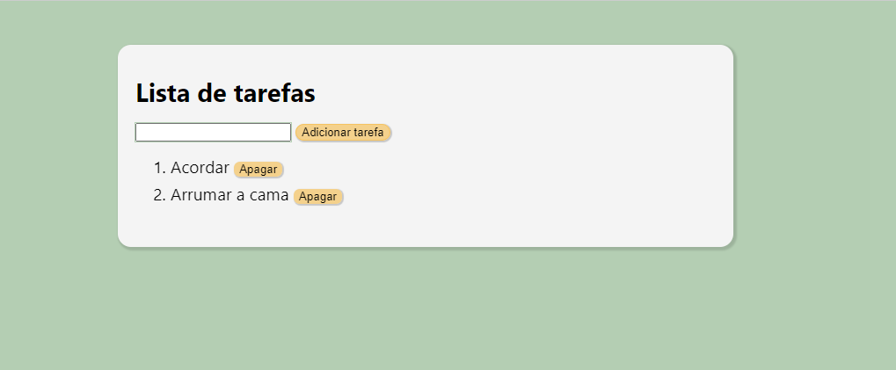

<h1 align="center"> To Do List</h1>

👩‍💻📖 Atividade desenvolvida no curso de Desenvolvimento Web  

 

  

## 🚀Tecnologias

Esse projeto foi desenvolvido com as seguintes tecnologias:

-> HTML, CSS e JavaScript
 
-> Git e Github

## 💻Projeto

- [Visite o projeto online](https://mariaeduardateixeira.github.io/to-do-list/)